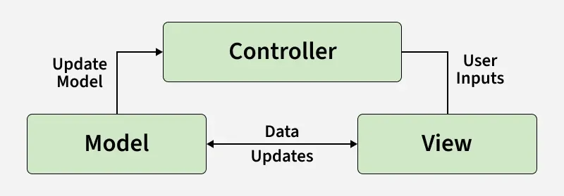
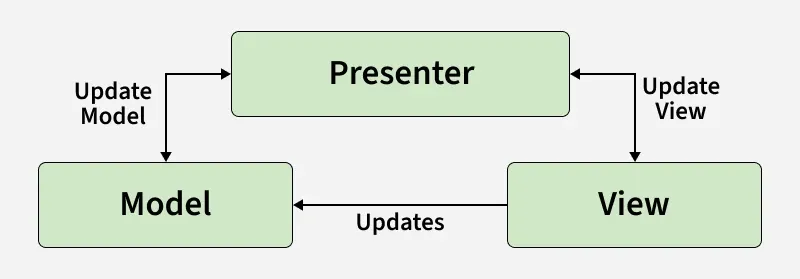
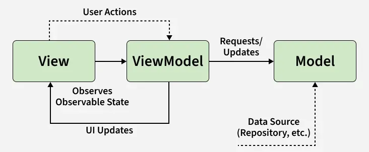

# Architectural Pattern

## Model-View-Controller (MVC) [Source](https://appmaster.io/blog/architectural-patterns-mvc-mvp-and-mvvm#model-view-presenter-mvp)
MVC is one of the software industry's most widely known and adopted architectural patterns. It was first introduced in the late 1970s by Trygve Reenskaug, a Norwegian computer scientist, and has since become a staple in application architecture. The pattern facilitates the separation of concerns by dividing the application into three main components:

- Model: Represents the data and business logic of the application. It is responsible for processing, storing, and managing data and implementing any necessary business rules. The model is independent of the user interface and does not directly communicate with the view or controller.
- View: Represents the application's user interface (UI) and presentation layer. The view's primary function is to display the data fetched from the model. It does not directly access the model but instead receives updates through the controller. Views can have multiple visual representations of the same data, enabling greater flexibility and adaptability.
- Controller: Acts as the intermediary between the model and the view. The controller receives user input from the view, processes it, and updates the model. Once the model is updated, it notifies the controller, which then refreshes the view with new data. The controller's primary responsibility is to manage application flow and keep the model and view in sync. MVC architecture promotes loosely coupled components, improving application maintainability and testing.

Since the model, view, and controller are independent, each component can be modified or replaced without affecting others. This separation of concerns also promotes code reuse and modular development, as components can be easily rearranged and combined to create new functionality. In an MVC application, communication between components primarily follows the observer pattern. The view registers with the controller as an observer, while the model registers with the controller as a subject. When the model changes, it notifies the controller, which then updates the view accordingly.

### Pros:
Separation of concerns improves code maintainability and reusability.
Loose coupling between components allows easy modification and replacement.
Supports multiple visual representations of the same data.
Promotes modular development and code reuse.

### Cons:
The controller can become a bottleneck for complex applications with many user interactions.
Can be difficult to implement for applications with complicated state or interaction requirements.

## Model-View-Presenter (MVP) [Source](https://appmaster.io/blog/architectural-patterns-mvc-mvp-and-mvvm#model-view-presenter-mvp)
MVP is an architectural pattern that addresses some of the drawbacks of the traditional MVC approach. It was first introduced in the 1990s as a specialization of MVC, focusing on improving the separation of concerns between the view and the model. MVP divides the application's components into three main parts:

- Model: Represents the data and business logic of the application, similar to the model in MVC. It is responsible for processing, storing, and managing data and implementing any necessary business rules. The model does not communicate directly with the view or presenter.
- View: Represents the user interface and presentation layer of the application. Like the view in MVC, its primary function is to display data fetched from the model. However, in MVP, the view is more passive and relies on the presenter for updates and user input handling. The view communicates only with the presenter and not with the model.
- Presenter: Acts as a bridge between the model and the view, taking on some of the controller's responsibilities in MVC. The presenter fetches data from the model and updates the view, ensuring the correct data presentation. Unlike the controller, the presenter also handles user input directly from the view and facilitates two-way communication between the view and the model.

The main difference between MVC and MVP lies in the controller and presenter's roles. In MVP, the presenter becomes more involved in user interactions and the flow of data between the view and the model, leaving the view as a passive component. This separation of concerns allows for better testability and modularity, as each component can be isolated and tested independently.

### Pros:
Improved separation of concerns between view and model.
The presenter facilitates better testability and modularity.
Each component can be modified or replaced without affecting others.
Better suited for applications with complex state or interaction requirements.

### Cons:
Increased complexity compared to traditional MVC, due to the presenter's added responsibilities.
Can lead to a larger codebase and the need for more boilerplate code.
Potential for communication overhead between the components.

## Model-View-ViewModel (MVVM) [Source](https://appmaster.io/blog/architectural-patterns-mvc-mvp-and-mvvm#model-view-presenter-mvp)
The Model-View-ViewModel (MVVM) architectural pattern has its roots in Microsoft's development stacks, and it was introduced as a response to the limitations of the MVP pattern, aiming to simplify UI development. MVVM is an evolution of the MVP pattern, focusing on the separation of concerns and enhancing testability. The MVVM pattern consists of three key components:

- Model: Represents the application's data and business logic. It is responsible for retrieving and storing data and processing any necessary data.
- View: Represents the user interface and displays the data to the user. In MVVM, the view is typically designed using a markup language like XAML, which allows for a clean separation of the UI design and the code-behind.
- ViewModel: Serves as a bridge between the Model and the View, responsible for holding the state of the View and carrying out any operations required to transform the data within the Model into a View-friendly format. It provides data binding between the Model and the View using observables, commands, and events. This communication is typically achieved by implementing the INotifyPropertyChanged interface.

In the MVVM pattern, the ViewModel does not hold any direct reference to the View. Instead, it communicates with the View via data binding and commands. This separation of concerns allows for easier testing and better separation of UI-related logic from the underlying business logic.
MVVM is particularly well-suited for complex UI applications, where extensive data-binding is required, and for projects using frameworks like WPF, UWP, Angular, and Xamarin.Forms. With its strong focus on UI development, MVVM has become popular in the world of mobile development for both iOS and Android platforms.

## Hexagonal Architecture (Ports and Adapters) [Source](https://en.wikipedia.org/wiki/Hexagonal_architecture_%28software%29)
Hexagonal Architecture, also known as *Ports and Adapters*, is a pattern that emphasizes isolating the business logic from external systems such as UI frameworks, databases, or messaging systems by defining interfaces (ports) and implementation adapters.

* **Core Idea:** Instead of organizing code into strict vertical layers, this architecture places the **business logic at the center** of a hexagon. All interactions with the outside world happen through abstract *ports* (interfaces) and *adapters* (implementations).
* **Ports:** Define what the core business logic needs from the outside world (e.g., persistence, UI interaction).
* **Adapters:** Are the concrete implementations that fulfill those port interfaces (e.g., REST API, database connector, CLI handler).
* **Benefits:** Allows the core logic to be developed and tested independently from UI or infrastructure concerns, improves flexibility to swap technologies, and supports robust testing with mocks or stubs.
* **Drawbacks:** Initial design can be more complex and conceptual compared to traditional layered approaches, requiring careful interface design.

### Pros of Hexagonal Architecture
* Strong isolation of business logic from external systems.
* Makes automated testing much easier because dependencies can be mocked.
* Encourages flexible swapping of UI, storage, or communication mechanisms.

### Cons of Hexagonal Architecture
* May require more upfront design effort.
* Adapters add indirection that can increase complexity for small systems.

## Plugin System [Source](https://cs.uwaterloo.ca/~m2nagapp/courses/CS446/1195/Arch_Design_Activity/PlugIn.pdf)
A *plugin system* is an architectural approach that allows software to be extended **dynamically** with independent modules (*plugins*) without modifying the core application.

* **Core System:** The minimal base application that defines how plugins are discovered, loaded, and integrated.
* **Plugins:** Self‑contained modules that implement additional features or behaviors and are loaded at runtime. Plugins register with the core through a standard interface or plugin registry.
* **Benefits:**
  * High extensibility: new features can be added without changing core code.
  * Modularity: each plugin can be developed, tested, and deployed separately.
  * Flexibility to customize the system based on use cases or environments.
* **Drawbacks:**
  * Need careful interface design so plugins interact consistently.
  * Managing plugin compatibility and dependencies can be complex.

### Pros of Plugin Systems
* Easy to add, remove, or update functionality.
* Encourages modular growth and independent feature development.

### Cons of Plugin Systems
* Increases complexity of core application logic.
* Plugin lifecycle and compatibility must be carefully managed to avoid runtime failures.

## Onion Architecture [Source](https://www.clarity-ventures.com/articles/onion-based-software-architecture)
Onion Architecture is closely related to Clean Architecture and organizes the system into **concentric layers centered around the domain model**, emphasizing that the **core business logic is completely isolated from infrastructure and UI concerns**.
* **Core Idea:** The domain model sits at the center, surrounded by layers like services, infrastructure, and UI. ([Clarity Ventures][2])
* **Dependency Rule:** All dependencies point inward toward the domain.
* **Layers:**

  * Domain (core logic)
  * Application services
  * Infrastructure (DB, APIs)
  * Presentation (UI)
* **Goal:** Protect the domain logic from external changes.

### Pros:
* Strong decoupling of UI and infrastructure from core logic.
* Encourages domain-driven design.
* Highly maintainable and testable.

### Cons:
* Conceptually similar to Clean/Hexagonal.
* Can introduce unnecessary layers in simple applications.

## Front Controller Pattern [Source](https://www.oracle.com/java/technologies/front-controller.html)
Front Controller is a pattern where **all UI requests go through a single centralized handler**, which then delegates to business logic components.

* **Core Idea:** One entry point for all UI interactions.
* **Flow:**
  * User → Front Controller → Business Logic → Response → View
* **Purpose:** Centralize control, routing, and preprocessing.

### Pros:
* Simplifies UI handling logic.
* Central place for authentication, logging, etc.

### Cons:
* Can become a bottleneck.
* Doesn’t fully decouple UI from business logic (only partially).

This is more of a **UI control pattern**, but still relevant for separation discussions.

## Backend-for-Frontend (BFF) [Source](https://learn.microsoft.com/en-us/azure/architecture/patterns/backends-for-frontends)
BFF is an architectural pattern where **each UI gets its own backend tailored to its needs**, while the core business logic remains separate.
* **Core Idea:** Separate backend layers for different UIs (desktop, mobile, embedded).
* **Structure:**
  * Core services (business logic)
  * Multiple BFF layers (UI-specific logic)
* **Goal:** Decouple UI-specific concerns from core logic.

### Pros:
* Perfect for multiple frontends.
* Keeps UI-specific logic out of core business logic.

### Cons:
* More services to maintain.
* Adds architectural overhead.

<!-- This one is actually **very relevant for the thesis** considering CLI vs GUI vs embedded. -->

## Model-View-Adapter (MVA) [Source](https://martinfowler.com/eaaDev/uiArchs.html)
MVA is a variation of MVC where an **adapter layer sits between the model and view**, translating data formats and interactions.
* **Core Idea:** Introduce an adapter to decouple UI representation from business logic.
* **Structure:**
  * Model (business logic)
  * Adapter (transformation layer)
  * View (UI)

### Pros:
* Cleaner separation than basic MVC.
* Useful when UI representation differs significantly from data model.

### Cons:
* Adds extra abstraction layer.
* Not as widely adopted as MVVM.

## Microkernel Architecture [Source](https://en.wikipedia.org/wiki/Microkernel_architecture)
Microkernel architecture separates a **minimal core system from extensible modules**, often used in plugin-based systems, but can also be backed in to avoid dynamic linking.

* **Core Idea:**
  * Core = business logic
  * Plugins = UI, extensions, features
* **Structure:**
  * Core system
  * Internal services
  * External plugins

### Pros:
* Extremely flexible and extensible.
* UI can be entirely externalized as plugins.

### Cons:
* possible complex plugin management.
* Debugging becomes complex.

