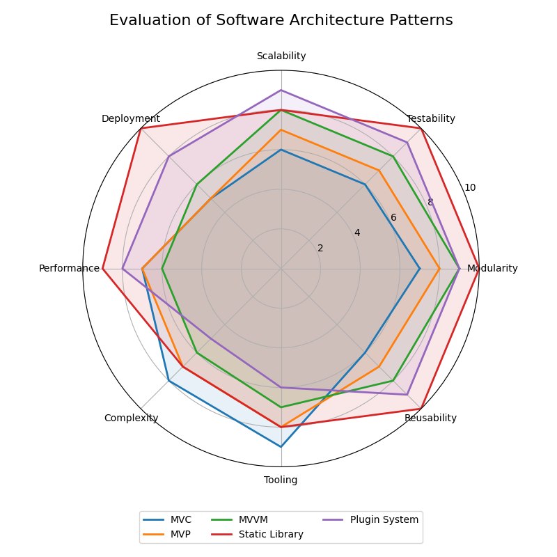

# Score Summery

## Score matrix
|                            | Se | Te | Sc | D  | P  | To |  R |
|----------------------------|----|----|----|----|----|----|----|
| MVC                        |  7 |  5 |  6 |  5 |  8 |  8 |  7 |
| MVP                        |  8 |  8 |  7 |  7 |  7 |  7 |  8 |
| MVVM                       |  9 |  9 |  8 |  9 |  6 |  4 |  4 |
| Hexagonal                  | 10 | 10 | 10 | 10 |  5 |  9 | 10 |
| Onion                      | 10 | 10 | 10 | 10 |  5 |  7 | 10 |
| Front Controller           |  5 |  3 |  4 |  4 |  7 |  6 |  4 |
| Backend-for-Frontend       |  9 |  8 |  9 |  8 |  7 |  7 |  6 |
| Model-View-Adapter         |  7 |  6 |  6 |  6 |  7 |  6 |  7 |
| Microkernel                |  9 |  8 |  9 | 10 |  9 |  8 |  9 |

| Onion                      |  9 |  9 |  8 |  8 |  6 |  7 |  8 |

## Weight per column
1.00    0.95    0.60    1.00    1.00    0.50    0.90

| Name | Importance |
|-|-|
| Separation                  | 1.00 |
| Testability                 | 0.95 |
| Scalability / Extensibility | 0.60 |
| Deployment Flexibility      | 1.00 |
| Performance / Efficiency    | 1.00 |
| Tooling                     | 0.50 |
| Reusability                 | 0.90 |

## Weighted score matrix
|                            | Se    | Te    | Sc    | D     | P     | To    |  R    |
|----------------------------|-------|-------|-------|-------|-------|-------|-------|
| MVC                        |  7.00 |  4.50 |  3.60 |  5.00 |  7.20 |  4.00 |  6.30 |
| MVP                        |  8.00 |  7.20 |  4.20 |  7.00 |  6.30 |  3.50 |  7.20 |
| MVVM                       |  9.00 |  8.10 |  4.80 |  9.00 |  5.40 |  2.00 |  3.60 |
| Hexagonal                  | 10.00 |  9.00 |  6.00 | 10.00 |  4.50 |  4.50 |  9.00 |
| Onion                      |  9.00 |  8.55 |  4.80 |  8.00 |  6.00 |  3.50 |  7.20 |
| Front Controller           |  5.00 |  2.70 |  2.40 |  4.00 |  6.30 |  3.00 |  3.60 |
| Backend-for-Frontend       |  9.00 |  7.20 |  5.40 |  8.00 |  6.30 |  3.50 |  5.40 |
| Model-View-Adapter         |  7.00 |  5.40 |  3.60 |  6.00 |  6.30 |  3.00 |  6.30 |
| Microkernel                |  9.00 |  7.20 |  5.40 | 10.00 |  8.10 |  4.00 |  8.10 |

